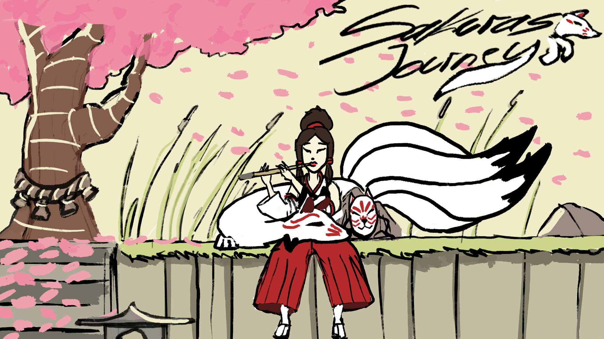
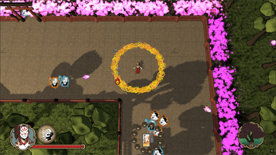
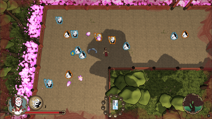
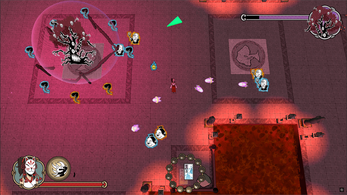

# 🌸 Sakura’s Journey – Temples of Corruption

[Watch the Trailer](https://www.youtube.com/watch?v=ZSyVVhhGdMc)

**Sakura’s Journey** is a fast-paced twin-stick arena shooter with tactical defense elements.  
The game was developed as part of the *School4Games* program and focuses on intense combat, enemy wave control, and system-driven gameplay.

🔗 **Project page:** https://www.jannikkluge.com/#/projects/SakurasJourney  
🌐 **Portfolio:** https://www.jannikkluge.com

---

## 🎮 About the Game

In *Sakura’s Journey*, players take on the role of **Kitsune Hime**, a fox-masked priestess bound to a divine spirit.  
Corrupted Yokai have taken over sacred temples, and it is the player’s task to cleanse them by surviving enemy waves, protecting key objectives, and defeating powerful bosses.

The game combines:
- Twin-stick shooter combat  
- Arena-based wave gameplay  
- Defensive objectives (e.g. protecting sacred sakura trees)  
- Progression and upgrade systems  

---

## 👨‍💻 My Role – Lead Game Engineer

I worked as **Lead Game Engineer**, responsible for the technical foundation and gameplay systems of the project.

### Core Responsibilities
- Designed and implemented core gameplay systems  
- Player movement, shooting mechanics, and combat flow  
- Enemy AI behavior and wave spawning logic  
- Upgrade and progression systems  
- Game state management and feature integration  

### Technical Ownership
- Defined the game’s technical architecture  
- Built reusable systems for enemies, combat, and progression  
- Maintained repository structure and builds  

---

## 🛠 Tools & Technologies

- **Godot Engine 4.3** – Core engine and scene system  
- **GDScript** – Gameplay logic and systems  
- **TortoiseHG** – Version control and collaboration  

More tools and engines I work with:  
➡️ https://www.jannikkluge.com/#/tools-and-engines

---

## 📸 Screenshots

  
*Arena combat and player abilities*

  
*Enemy wave system and UI*

  
*Boss encounter inside a corrupted temple*

---

## 🚀 Play the Game

You can find more information, downloads, and videos here:  
➡️ https://www.jannikkluge.com/#/projects/SakurasJourney

---

## 🤝 Contact

If you want to learn more about my work or collaborate:

🌐 Portfolio: https://www.jannikkluge.com  
📧 Email: *jannikkluge2006@gmail.com*  
💼 GitHub: https://github.com/prayyOnIntelliJ
